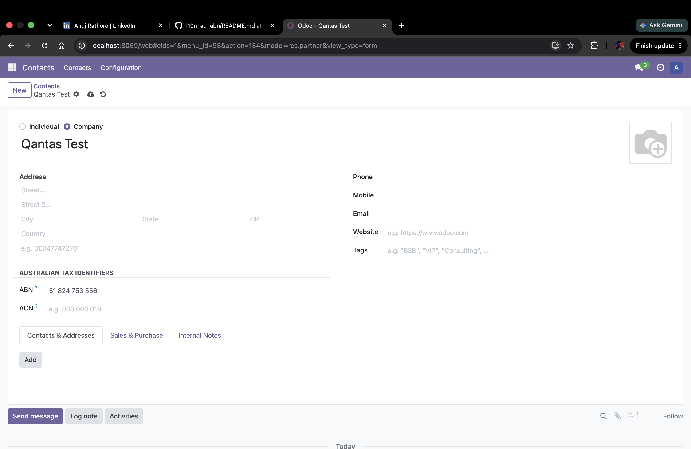
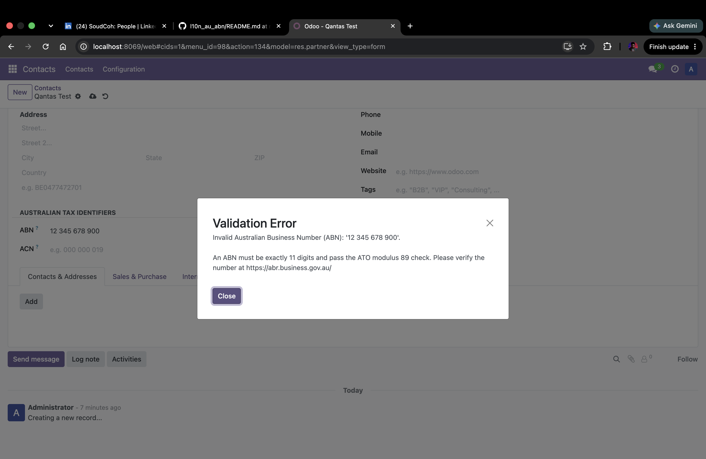
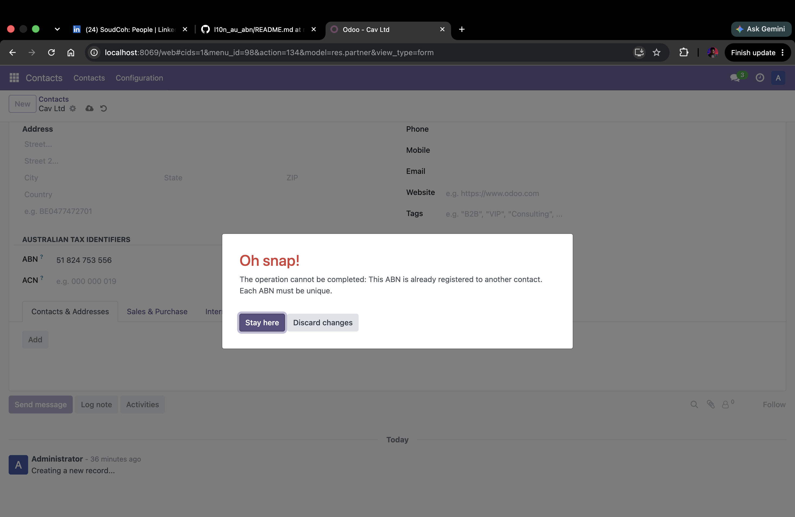

# Australian ABN / ACN Validation for Odoo 17

[](https://www.gnu.org/licenses/lgpl-3.0)
[](https://www.odoo.com)
[](https://www.python.org)
[](https://github.com/vinothkumarkarthikeyan/l10n_au_abn/actions/workflows/ci.yml)
[](#testing)

An Odoo 17 localisation module that validates and auto-formats **Australian Business Numbers (ABN)** and **Australian Company Numbers (ACN)** at the point of entry — stopping invalid tax identifiers and duplicate records before they ever reach your database.

Built to the official **ATO** and **ASIC** specifications, with the check-digit algorithms implemented from scratch and covered by 30+ automated tests.

---

## 📸 Screenshots

**Valid ABN — auto-formats on entry**


**Invalid ABN — rejected**


**Duplicate ABN — blocked**



## ✨ Features

- **ABN validation** using the official **ATO weighted modulus 89** algorithm (11 digits)
- **ACN validation** using the official **ASIC check-digit** algorithm (9 digits)
- **Real-time auto-formatting** — `XX XXX XXX XXX` for ABN, `XXX XXX XXX` for ACN — via `@api.onchange`
- **Duplicate prevention** through a database-level SQL constraint
- **Clear, user-friendly error messages** that explain *why* an entry was rejected
- **Search & filter** on validated identifiers
- Ships with **demo data** (real, well-known Australian company ABNs) for instant testing

---

## 🧮 How It Works

**ABN — ATO Modulus 89**
1. Subtract 1 from the first (leftmost) digit.
2. Multiply each of the 11 digits by its position weight `[10, 1, 3, 5, 7, 9, 11, 13, 15, 17, 19]`.
3. Sum the results. The ABN is valid if the total is divisible by 89.

**ACN — ASIC Check Digit**
1. Multiply the first 8 digits by weights `[8, 7, 6, 5, 4, 3, 2, 1]` and sum them.
2. The check digit is `(10 − (sum mod 10)) mod 10`; it must match the 9th digit.

_Example:_ Qantas Airways — ABN `16 009 661 901` → passes the modulus-89 check and auto-formats on entry.

---

## 🚀 Installation

```bash
# 1. Clone into your Odoo addons path
cd /path/to/odoo/addons
git clone https://github.com/vinothkumarkarthikeyan/l10n_au_abn.git

# 2. Update the apps list and install
#    Odoo → Apps → Update Apps List → search "Australian ABN / ACN" → Install
#    or from the command line:
odoo -d your_database -i l10n_au_abn
```

**Requirements:** Odoo 17.0, Python 3.10+, PostgreSQL.

---

## 🧑‍💻 Usage

1. Open any record with an ABN/ACN field (e.g. a Contact or Company).
2. Type an identifier — it auto-formats as you go.
3. Invalid identifiers are rejected immediately with an explanatory message.
4. Attempting to save a duplicate is blocked by the SQL constraint.

---

## ✅ Testing

Run the full suite (30+ tests covering the validation logic, formatting and constraints):

```bash
odoo -d test_db -i l10n_au_abn --test-enable --stop-after-init
```

Every push runs these tests automatically via GitHub Actions — see the **CI badge** at the top.

---

## 📁 Project Structure

```
l10n_au_abn/
├── models/          # ORM models + ABN/ACN validation logic
├── views/           # XML view definitions
├── security/        # Access-control rules
├── tests/           # 30+ automated unit tests
├── demo/            # Demo data (real Australian company ABNs)
├── __manifest__.py  # Module manifest
└── README.md
```

---

## 🗺️ Roadmap

Current release (**v1.0**) delivers complete offline validation and formatting. Possible future enhancements:

- [ ] Live ABN lookup via the ABR (Australian Business Register) API
- [ ] GST-registration status checks
- [ ] ARBN support for registered foreign companies

---

## 📄 License

Licensed under the **LGPL-3.0** — see [LICENSE](LICENSE).

## 👤 Author

**Vinoth Kumar Karthikeyan** — [LinkedIn](https://www.linkedin.com/in/vinothkarthikeyan21/) · [GitHub](https://github.com/vinothkumarkarthikeyan)

_Built with a focus on correctness, clear documentation, and full test coverage — feedback and contributions welcome._